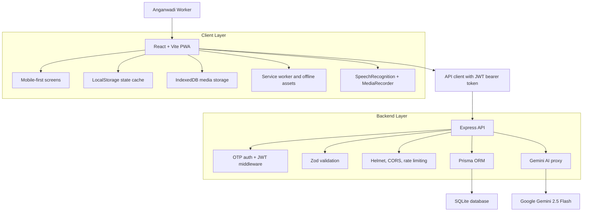

# Pratibha AI

Voice-first, offline-ready Anganwadi assistant for child development tracking, reporting, and AI-guided field support.

| Team Name | Hacker Heist |
| --- | --- |
| Team Members | Mohd Shadab & Aviral Trivedi |

---

## Overview

Pratibha AI is a full-stack prototype designed for Anganwadi Workers who manage child attendance, nutrition follow-ups, developmental observations, home visits, activity planning, and government-style reports in low-connectivity environments.

The application reduces repetitive paperwork by combining a mobile-first Progressive Web App, offline local storage, voice-based report capture, structured child records, PDF report generation, and a secure Gemini AI backend proxy. It is built around a realistic Anganwadi workflow: a worker can log in, mark attendance, record observations by voice, ask an AI mentor for insights, schedule home visits, generate reports, and sync pending work when connectivity returns.

---

## Supporting Documents

- [Presentation Deck](doc/Pratibha%20AI%20PPT.pptx)
- [Technical Analysis Report](doc/Pratibha_AI_Analysis_Report.pdf)

---

## Problem Statement

Anganwadi Workers are responsible for a wide range of critical duties:

- Tracking daily attendance and child development milestones.
- Monitoring nutrition and identifying children who need support.
- Recording observations from classroom and home visit interactions.
- Preparing reports for supervisors and government programs.
- Working in areas where internet connectivity can be unreliable.

Manual paperwork and fragmented record keeping consume time that could otherwise be spent with children and families. Pratibha AI addresses this by creating a practical, field-friendly digital workflow that works even when the network does not.

---

## Solution Highlights

- **Voice-first reporting:** Workers can speak naturally and convert daily notes into structured attendance and child observations.
- **Offline-first workflow:** Key data is persisted locally, pending actions are queued, and the sync endpoint reconciles changes when the backend is reachable.
- **AI mentor:** A contextual assistant can answer questions about attendance, nutrition, home visits, progress, and daily summaries using the current child registry.
- **Secure AI proxy:** Gemini API access is handled server-side so API keys are not exposed in the browser.
- **Government-style PDF reports:** Dynamic attendance, nutrition, development, and weekly reports can be generated and exported.
- **Mobile-first PWA:** The frontend is designed as a phone-like Anganwadi field app with installable PWA metadata and offline assets.
- **Authentication and security:** OTP login, JWT sessions, protected API routes, request validation, CORS controls, Helmet headers, and rate limiting are included.

---

## Key Features

### Worker Authentication

- OTP-based login flow for registered Anganwadi workers.
- JWT-backed session validation.
- Offline fallback for demo mode when the backend is unreachable.
- Optional remember-me and PIN unlock flow.

### Child Registry

- Child profiles with age, parent details, nutrition status, development progress, milestones, attendance history, and observations.
- Attendance toggle for daily tracking.
- Text, voice, and photo-style observations.
- Needs-attention indicators for children requiring follow-up.

### Voice Report Capture

- Browser speech recognition for English and Indian language modes.
- Audio recording preview through the MediaRecorder API.
- IndexedDB storage for recorded media.
- Gemini-powered structured parsing where configured.
- Local regex-based parser fallback when AI or network access is unavailable.

### AI Mentor

- Chat interface for asking operational questions such as:
  - "Which children missed attendance this week?"
  - "Who needs a home visit?"
  - "Generate nutrition summary."
  - "Suggest activity for shy children."
- RAG-style context compiler that summarizes current child records and recent observations.
- Streaming Gemini response support through the backend.
- Local NLU fallback mode for offline or demo use.

### Offline Sync

- Local state persistence through browser storage.
- Pending sync queue for attendance, observations, activities, voice reports, and home visits.
- Backend `/api/sync` endpoint applies queued operations.
- Last-write-wins conflict handling with notification creation for sync conflicts.

### Reports and Impact

- Dynamic reports for attendance, nutrition, development, weekly summaries, and custom reports.
- PDF export with official-style formatting.
- Time-saved and impact indicators based on logged work.

### Activity and Home Visit Planning

- Schedule activities for selected children.
- Add and complete home visits.
- Suggested discussion topics for family follow-up.
- Notifications for alerts, reports, AI insights, sync status, and updates.

---

## Demo Credentials

After seeding the backend database, use one of these demo workers:

| Worker ID | Mobile Number | Worker Name |
| --- | --- | --- |
| `AW-4521` | `9876543210` | Sunita Ji |
| `AW-1234` | `9123456789` | Saraswati Devi |

In development mode, the backend prints the generated OTP in the server console. If the frontend cannot reach the backend, the offline fallback code is `1234`.

---

## Architecture



---

## Tech Stack

| Layer | Technology |
| --- | --- |
| Frontend | React 19, TypeScript, Vite 7 |
| Styling | Tailwind CSS, shadcn-style UI components, Lucide icons |
| State and UX | React Context, custom hooks, LocalStorage, IndexedDB |
| PWA | Web app manifest, service worker, offline page |
| Voice | Web Speech API, MediaRecorder API |
| Reports | jsPDF |
| Backend | Node.js, Express |
| Database | SQLite with Prisma ORM |
| Auth and Security | JWT, Helmet, CORS, express-rate-limit, Zod |
| AI | Gemini 2.5 Flash through backend proxy |
| Testing | Vitest, Testing Library, Supertest |

---

## Repository Structure

```text
.
|-- backend/
|   |-- index.js                 # Express API, auth, sync, Gemini proxy
|   |-- db.json                  # Seed data for workers, children, visits, notifications
|   |-- middleware/auth.js        # JWT route protection
|   |-- prisma/
|   |   |-- schema.prisma         # SQLite data model
|   |   `-- seed.js               # Database seed script
|   `-- tests/                    # Backend API tests
|-- frontend/
|   |-- public/                   # PWA assets, service worker, offline page
|   `-- src/
|       |-- screens/              # App screens and workflows
|       |-- context/              # Shared app and language state
|       |-- hooks/                # Auth, children, visits, offline, speech hooks
|       |-- lib/                  # API client, constants, IndexedDB, utilities
|       |-- data/                 # Mock/demo data
|       `-- components/           # Navigation, toast, UI primitives
|-- doc/
|   |-- Pratibha AI PPT.pptx
|   `-- Pratibha_AI_Analysis_Report.pdf
|-- package.json                  # Root scripts for frontend + backend
`-- vercel.json                   # Frontend deployment config
```

---

## Getting Started

### Prerequisites

- Node.js 20 or later
- npm
- A Gemini API key for live AI features

### 1. Install Dependencies

Run this from the repository root:

```bash
npm run install:all
```

### 2. Configure Backend Environment

Create `backend/.env`:

```env
JWT_SECRET=replace_with_a_long_random_secret
PORT=5000
ALLOWED_ORIGINS=http://localhost:5173,http://localhost:3000
GEMINI_API_KEY=your_gemini_api_key_here
DATABASE_URL=file:./dev.db
```

`GEMINI_API_KEY` is optional for basic app navigation, local fallback flows, and offline simulation. It is required for live Gemini AI chat and AI voice-report parsing.

### 3. Initialize the Database

```bash
cd backend
npx prisma db push
npx prisma db seed
cd ..
```

### 4. Start the Full App

```bash
npm run dev
```

Default local URLs:

- Frontend: `http://localhost:5173`
- Backend API: `http://localhost:5000`

---

## Available Scripts

| Command | Description |
| --- | --- |
| `npm run dev` | Starts frontend and backend together |
| `npm run dev:frontend` | Starts only the Vite frontend |
| `npm run dev:backend` | Starts only the Express backend |
| `npm run build` | Builds the frontend for production |
| `npm run install:all` | Installs frontend and backend dependencies |
| `npm run test` | Runs frontend and backend tests |
| `npm run test:frontend` | Runs frontend tests only |
| `npm run test:backend` | Runs backend tests only |

---

## Suggested Judge Demo Flow

1. Open the app and choose a language.
2. Log in with `AW-4521` and `9876543210`.
3. Enter the OTP printed by the backend console, or use `1234` if running in offline fallback mode.
4. Review the dashboard, attendance status, children needing attention, and notifications.
5. Open a child profile and add an observation.
6. Use **Voice Report** to speak a daily update, review the structured output, and save it.
7. Switch offline mode on, perform an attendance or home visit action, and observe the pending sync queue.
8. Return online and trigger sync to upload queued changes.
9. Open **AI Mentor** and ask: `Who needs a home visit?`
10. Open **Reports**, generate a new report, and export it as PDF.

---

## API Summary

| Method | Endpoint | Purpose |
| --- | --- | --- |
| `POST` | `/api/auth/send-otp` | Validate worker and generate OTP |
| `POST` | `/api/auth/verify-otp` | Verify OTP and issue JWT |
| `GET` | `/api/auth/validate` | Validate active JWT session |
| `GET` | `/api/children` | Fetch child registry |
| `POST` | `/api/children/observation` | Add child observation |
| `PUT` | `/api/children/attendance` | Update attendance |
| `GET` | `/api/visits` | Fetch home visits |
| `POST` | `/api/visits` | Schedule home visit |
| `PUT` | `/api/visits/:id/complete` | Complete home visit |
| `GET` | `/api/notifications` | Fetch notifications |
| `PUT` | `/api/notifications/read-all` | Mark notifications as read |
| `DELETE` | `/api/notifications/:id` | Delete notification |
| `POST` | `/api/activities/schedule` | Schedule activity |
| `POST` | `/api/sync` | Upload offline queue |
| `POST` | `/api/ai/chat` | Secure Gemini proxy |

---

## Security and Reliability

- JWT authentication protects child, visit, notification, sync, and AI routes.
- OTP verification is backed by registered worker records.
- Zod validates request bodies before route handlers run.
- Helmet adds secure HTTP headers.
- CORS allowlist limits browser origins.
- Rate limiting protects auth and general API routes.
- Gemini API key stays on the backend, not in frontend code.
- Offline fallback prevents the demo from failing when connectivity is unavailable.

---

## Testing

Run the full test suite:

```bash
npm run test
```

The project includes:

- Frontend component and utility tests with Vitest and Testing Library.
- Backend API tests with Vitest and Supertest.
- Dedicated setup files for test environment configuration.

---

## Deployment Notes

The included `vercel.json` builds and serves the frontend from `frontend/dist`.

For a complete hosted deployment, deploy the backend separately with the required environment variables, then configure the frontend with:

```env
VITE_API_BASE=https://your-backend-domain.com/api
```

---

## Future Scope

- Replace development OTP logging with a real SMS gateway.
- Add supervisor dashboard and cross-center analytics.
- Add role-based access for workers, supervisors, and administrators.
- Improve conflict resolution beyond last-write-wins for multi-worker editing.
- Add richer multilingual QA for Hindi, Bengali, Marathi, and Hinglish.
- Integrate official ICDS or state-level data formats where available.

---

## Project Identity

Pratibha AI is built as a practical, judge-demo-ready prototype for reducing Anganwadi paperwork while improving child-centered decision support.

| Built By | Team Hacker Heist |
| --- | --- |
| Members | Mohd Shadab & Aviral Trivedi |
